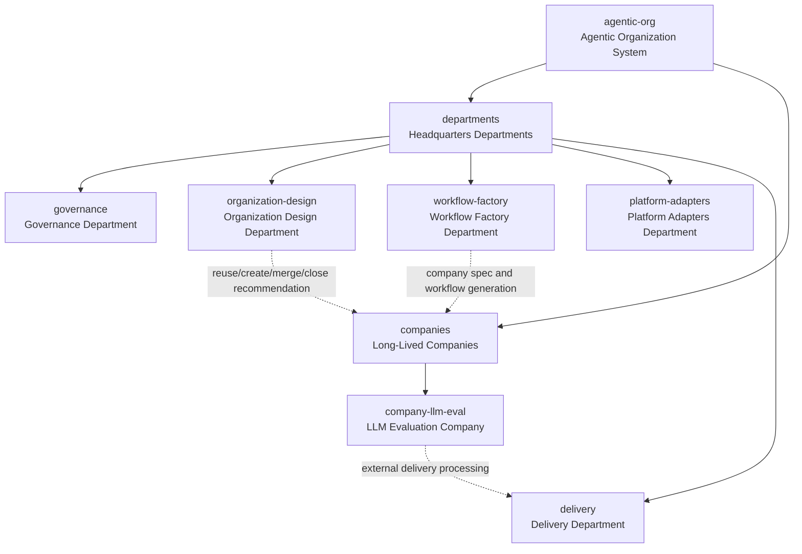

# agentic-org Organization Structure

## Positioning

`agentic-org` is a headquarters-centered agentic organization system.

The project focuses on building headquarters capabilities. A user describes a workflow; headquarters first checks whether an existing company can be reused. If reuse is not suitable, headquarters generates a long-lived company. The company executes concrete work only after approval.

The Highest Leader has final decision authority.

## Organization Chart

## Headquarters Responsibilities

- Governance: standards, authority, naming, lifecycle, performance, approval, schemas, and standard levels.
- Organization Design: decide reuse or creation, design companies, departments, and roles, and recommend merges or closures.
- Workflow Factory: convert user-described workflows into `company.spec.json`, company directories, departments, agents, workflows, and runtime adapters.
- Platform Adapters: adapt the organization source of truth to Codex, Claude Code, OpenCode, and other runtimes.
- Delivery: convert company internal artifacts into external deliverables.

## Company Principle

Companies are long-lived business execution units generated by headquarters. They are not disposable task folders. A company may be paused, reviewed, merged, or closed only through headquarters governance and Highest Leader approval.
