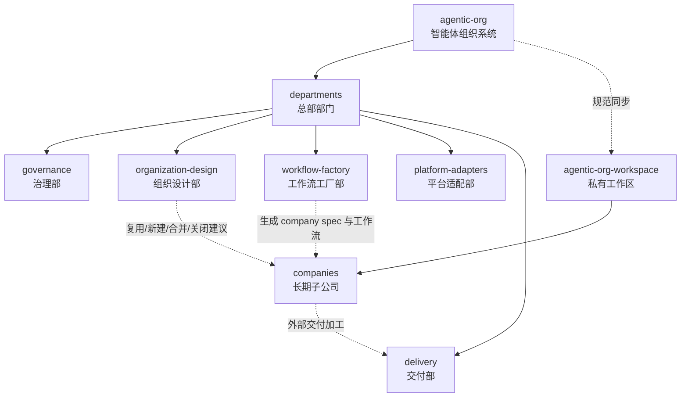

# agentic-org Organization Structure

## 中文版

### 定位

`agentic-org` 是一个以总部治理能力为核心的智能体组织系统。

项目重点不是手工维护某一家子公司，而是建设一套“总部系统”：用户描述一个工作流后，总部先判断是否复用已有子公司；如果不能复用，再生成一家长期存在的子公司，并由该子公司在得到确认后执行具体需求。

最高领导者 / Highest Leader 拥有最终裁决权。

## 组织图

## 总部职责

- 治理部：制度、权限、命名、生命周期、绩效、审批、schema 与规范等级。
- 组织设计部：判断复用还是新建，设计公司、部门、岗位，并提出合并或关闭建议。
- 工作流工厂部：把用户描述的工作流转为 `company.spec.json`、公司目录、部门、agent、workflow 和 runtime adapter。
- 平台适配部：适配 Codex、Claude Code、OpenCode 等运行平台。
- 交付部：把子公司内部产物加工为外部交付物。

## 子公司原则

子公司是总部能力生成出的长期业务执行单元，不是一次性任务目录。子公司可以被暂停、评估、合并或关闭，但必须经过总部治理流程和最高领导者确认。

公共 `main` 分支不维护真实子公司。真实子公司应放在私有 `agentic-org-workspace` 仓库中。

## English Version

`agentic-org` is a headquarters-centered agentic organization system. A user describes a workflow; headquarters decides whether to reuse an existing company or create a new long-lived company. Execution of a company workflow requires approval.

The public `main` branch contains headquarters standards only. Real companies should live in a private workspace repository.
